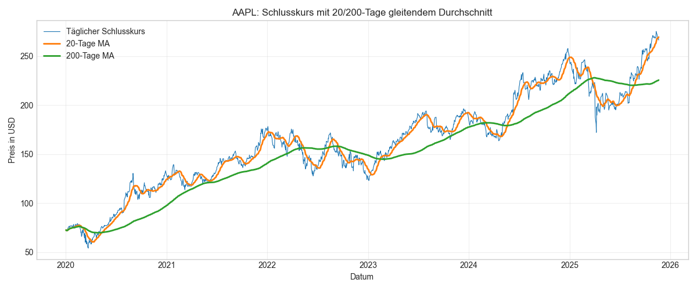
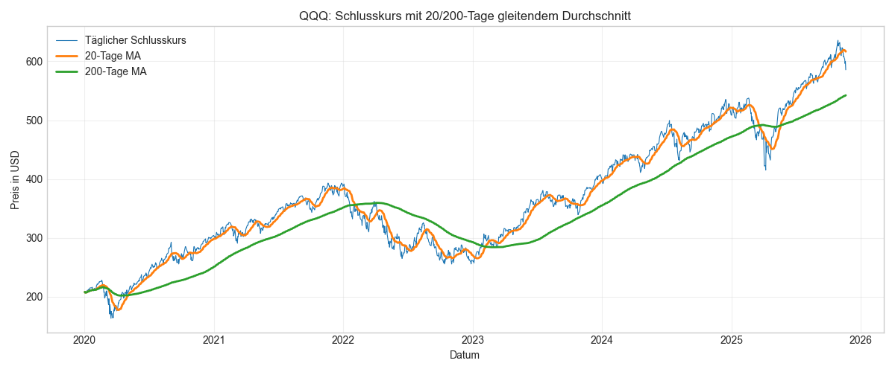
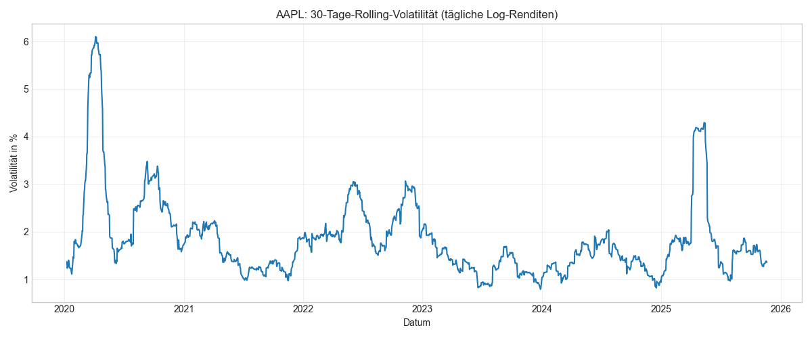
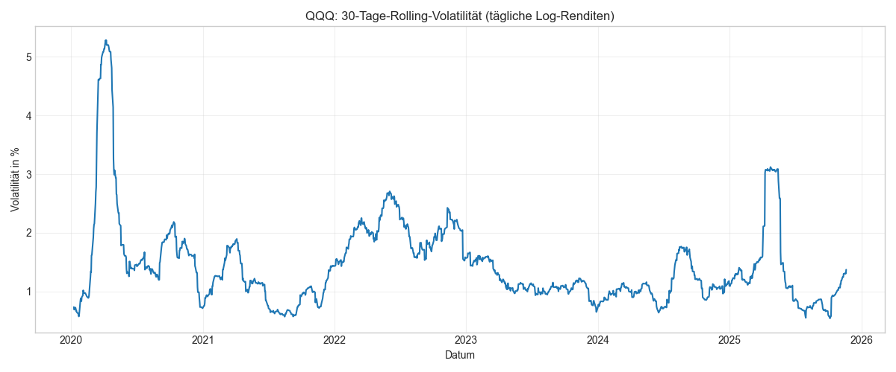
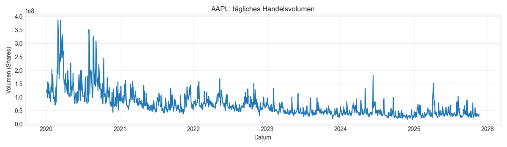
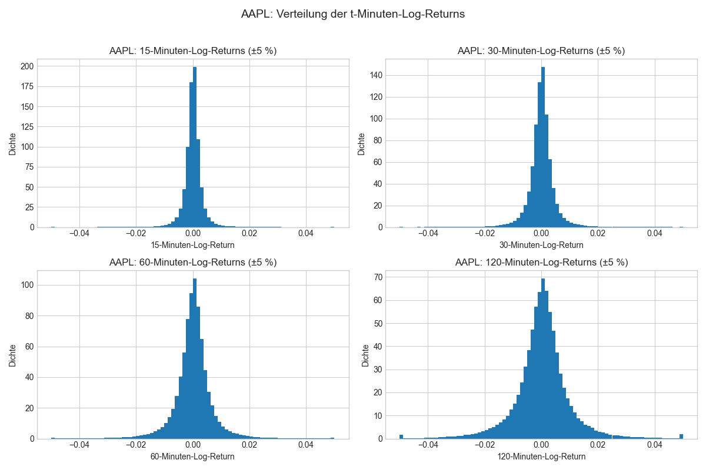
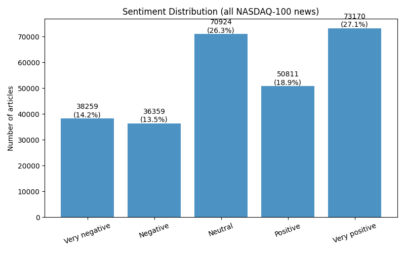
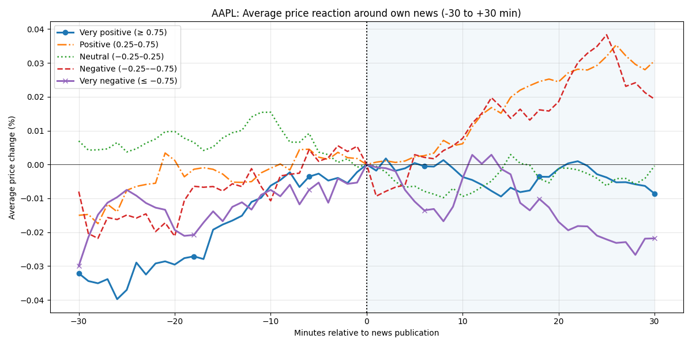
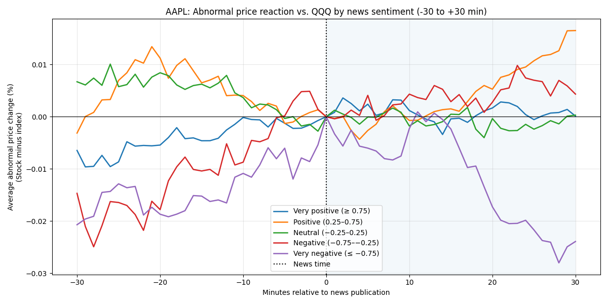
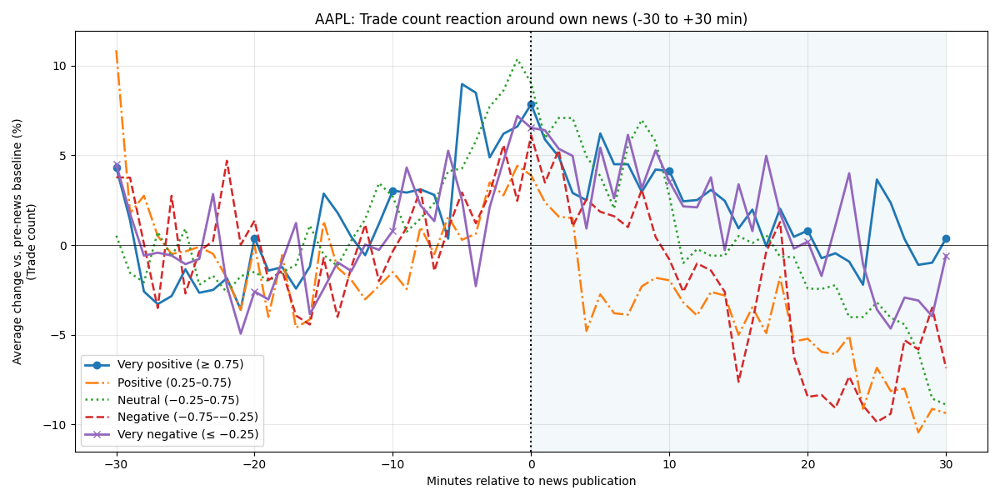

# USW_Trading

### Problem Definition:
**Ziel**

Vorhersage der nächsten t=[15, 30, 60, 120] Minuten Trendrichtung für ausgewählte NASDAQ-100-Aktien (META, TSLA, AMZN, AAPL, NVDA) während der regulären US-Handelszeiten. Für jede NASDAQ-100-Aktie und jede 1-Minuten-Kerze im Zeitraum vom 01.01.2020 bis 21.11.2025 berechnen wir die die erwartete Preisveränderung über die zukünftigen t Minuten der Aktie. Dabei werden Minuten-Daten und News genutzt, damit wiederkehrende Strukturen wie Volatilität oder newsgetriebene Bewegungen identifiziert werden.

**Input Features**

- Normalisierte Intraday-OHLCV-Daten (Open, High, Low, Close, Volume) mit 1-Minuten-Frequenz und den zugehörigen Log-Returns
- Normalisierte exponentielle gleitende Durchschnitte (EMA) von Preis und Volumen über t = [5, 15, 30, 60, 120] Minuten
- Aktien­spezifische Volatilitätsmerkmale
- Normalisierte Indexmerkmale wie NASDAQ-100-Indexrendite und Intraday-Volatilität
- Sentiment-Scores aus Überschriften und Zusammenfassungen pro Aktie

### Verfahrensübersicht:

- Sammelt für die fünf NASDAQ-100-Ticker META, TSLA, AMZN, AAPL und NVDA 1-Minuten-Kursdaten für den Zeitraum vom 01.01.2020 bis 21.11.2025 und ruft Nachrichten pro Ticker ab, um Sentiment-Scores zu berechnen.
- Sagt die Richtung des Trends über nächste t Minuten vorraus mit einem Neural Network
- Verwendet einen Entscheidungsbaum, um Einstiege mit positiver Trendrichtung zu prognostizieren
- Implementiert eine Trading Strategie in Alpaca

**Wir hoffen zu zeigen, dass die Kombination technischer Indikatoren mit News-Sentiment die kurzfristige Trendvorhersage verbessert**

---

## Data Acquisition
Ruft rohe Marktdaten und Nachrichtenartikel für die ausgewählten Nasdaq-100-Symbole ab und berechnet den Sentiment-Score.

**Script**

[scripts/01data_acquisition.py](scripts/01data_acquisition.py)

Holt **1‑minuten** Kerzen von **2020‑01‑01 bis 2025‑11‑21** und schreibt `symbol.parquet` Dateien zu `data/raw/Prices_1m_adj`.

- `columns`: `timestamp`, `open`, `high`, `low`, `close`, `volume`, `trade_count`,`vwap`, `symbol`   

Bar data AAPL Beispiel:

[scripts/fetch_nasdaq100_news_alpaca.py](scripts/fetch_nasdaq100_news_alpaca.py) 

Holt historische Nachrichtenartikel von **2020‑01‑01 bis 2025‑11‑21** und erstellt `symbol.parquet` Dateien zu `data/raw/News_alpaca`

- `colums`: `author`, `content`, `created_at`, `headline`, `id`, `images`, `source`, `summary`, `symbols`, `updated_at`, `url`,`symbol`

[scripts/news_sentiment_score.py](scripts/news_sentiment_score.py)  

Berechnet den Sentiment Score für jeden Nachrichtenartikel und erstellt`data/processed/nasdaq_news_with_sentiment.parquet` file.

- `columns`: `id`, `content`, `symbol`, `sentiment_score`,

Sentiment score AAPL Beispiel:

**API**

#### Alpaca Market Data API
Ruft historische 1-Minuten-Kerzendaten für die ausgewählten NASDAQ-100 Symbole und QQQ über die Alpaca Data API ab. Die Daten werden im Parquet-Format unter `data/raw/Prices_1m_adj` gespeichert.

#### Parameter
- `symbol_or_symbols`: Liste von Tickern
- `timeframe`: 1Min (1-Minuten Bars)
- `start`: Start-Datum 2025-01-01
- `end`: End-Datum 2025-11-21
- `adjustment`: adjustiert für Splits & Dividenden

#### Alpaca Trading API
Filtern nach den Minuten, die innerhalb der regulären Handelszeiten des offiziellen US-Handelskalender liegen.

#### Parameter
- `start`: Start-Datum (01.01.2020)
- `end`: End-Datum 

#### Alpaca News API
Ruft Nachrichtenartikel seit 1.1.2020 für die ausgewählten NASDAQ-bezogene Symbole über die Alpaca News API ab. Die Daten werden in `data/raw/News_alpaca` gespeichert.

#### Parameter 
- `symbols`: Symbole, die geladen werden müssen
- `start`: Start-Datum (01.01.2020)
- `end`: End-Datum (21.11.2025)
- `limit`: 50 (Anzahl Artikel pro Anfrage)
- `sort`: desc
- `include_content`: false (HTML-Content nicht nötig)

#### FinBERT API
Berechnet den sentiment score jedes Nachrichtenartikel. Die Daten werden in `data/processed/nasdaq_news_with_sentiment.parquet` gespeichert.

#### Parameter
- `text`: (Headline + Summary)
- `return_tensors`: pt (Ausgabe als PyTorch-Tensors)
- `truncation`: True (Text wird auf max_length abgeschnitten)
- `max_length`: 512 (maximale Tokenlänge)

---

## 2 - Data Understanding

### Moving Average
Trenderkennung mithilfe von gleitenden Durschnitten

Die Grafik kombiniert den täglichen Schlusskurs von AAPL mit einem kurzfristigen 20-Tage- und einem langfristigen 200-Tage-Durchschnitt. Liegt der Kurs über beiden Linien, dominiert ein Aufwärtstrend. Phasen, in denen der Kurs den 20-Tage-MA von oben nach unten schneidet oder sich dem 200-Tage-MA annähert, markieren dagegen mögliche Trendwechsel oder Korrekturen.

Langfristiger Trend des NASDAQ-100-Index.

Der Indexverlauf mit 20- und 200-Tage-Durchschnitt macht den übergeordneten Markttrend sichtbar. Längere Phasen über dem 200-Tage-MA entsprechen typischen Bullenmärkten, Unterschreitungen deuten auf schwächere Marktphasen hin. So lässt sich AAPLs Entwicklung im Kontext des Gesamtmarktes einordnen.

### Volatilität
Zeigt, wie stark die Aktie im letzten Monat typischerweise geschwankt hat.

Hohe Volatilitätswerte deuten auf turbulente Marktphasen hin – etwa um Krisen, Earnings oder größere Makro-Events. Niedrige Werte stehen für ruhige Marktphasen mit kleineren Tagesbewegungen. Man erkennt, dass AAPL in einzelnen Episoden deutlich erhöhte Schwankungen aufweist, während längere Strecken eher moderat verlaufen.

Der Vergleich mit der entsprechenden Volatilitätskurve des NASDAQ-100-ETF QQQ zeigt, dass AAPL zwar grob den Marktbedingungen folgt, aber zeitweise deutlich volatilere Ausschläge hat – also zusätzlich stock-spezifischem Risiko unterliegt.

### Volumen
Entwicklung des täglichen Handelsvolumens über den betrachteten Zeitraum.

Spitzen im Volumen markieren Tage mit besonderer Marktaktivität, z. B. nach Unternehmensmeldungen oder in Phasen erhöhter Unsicherheit. So können wir sehen, ob starke Kursbewegungen von breitem Marktinteresse getragen werden

### Verteilung log Returns
Analyse der kurz- bis mittelfristigen Kursbewegungen

Die Histogramme zeigen, wie sich AAPLs Log-Returns über 15, 30, 60 und 120 Minuten verteilen. Die meisten Bewegungen liegen sehr nahe bei 0 %. Mit zunehmender Dauer (von 15 min bis 120 min) werden die Verteilungen breiter. über längere Zeitfenster sind größere Preisbewegungen wahrscheinlicher. Für unser Projekt ist das wichtig, weil wir genau diese Bewegungen mit den Targets vorhersagen wollen

### Sentiment-Verteilung
Übersicht der News-Stimmungen im Datensatz.

Die Balkengrafik zeigt, wie viele Artikel sehr negativ, negativ, neutral, positiv oder sehr positiv eingestuft wurden. Man erkennt, dass neutrale bis leicht positive Meldungen dominieren, während extreme Stimmungen seltener sind. Diese Verteilung bildet die Grundlage für alle späteren Analysen, in denen News-Sentiment als erklärende Variable verwendet wird.

### Preisreaktion rund um AAPL-News
Analyse der durchschnittlichen Kursreaktion auf eigene Unternehmensmeldungen.

Die Linien zeigen, wie sich der AAPL-Preis im Umfeld von News-Zeitpunkten entwickelt – getrennt nach Sentimentklassen. Positive und negative Meldungen führen im Schnitt zu steigenden Kursen nach der Veröffentlichung, stark negative Meldungen zu fallenden Preisen. Neutrale News zeigen kaum systematische Bewegung. Das bestätigt, dass Sentiment kurzfristig ein wichtiger Treiber für Kursreaktionen ist.

### Abnormale Preisreaktion vs. QQQ
Stock-spezifische Reaktion im Vergleich zum Markt.

Hier wird die Preisänderung von AAPL relativ zum Index (AAPL minus QQQ) betrachtet. Dadurch werden marktweite Effekte herausgefiltert. Man erkennt, dass positiv bewertete News zu einer Outperformance gegenüber dem Index führen, während sehr negative Meldungen zu deutlicher Underperformance führen. Damit zeigt sich, dass News-Sentiment nicht nur absolute Preise, sondern auch die relative Performance gegenüber dem Markt beeinflusst.

### Trade Count
Trade-Aktivität rund um News-Ereignisse

Die Grafik zeigt, wie stark die Anzahl der Trades im Zeitfenster von −30 bis +30 Minuten relativ zu einem Vor-News-Baseline ansteigt. Rund um den News-Zeitpunkt gibt es in allen Sentiment-Gruppen einen deutlichen Spike der Trade-Aktivität. Das ist wichtig, weil hohe Trade-Aktivität oft mit stärkeren kurzfristigen Trends einhergeht.