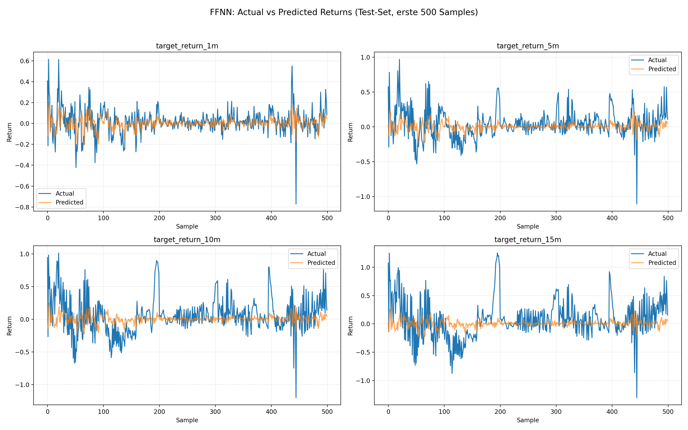
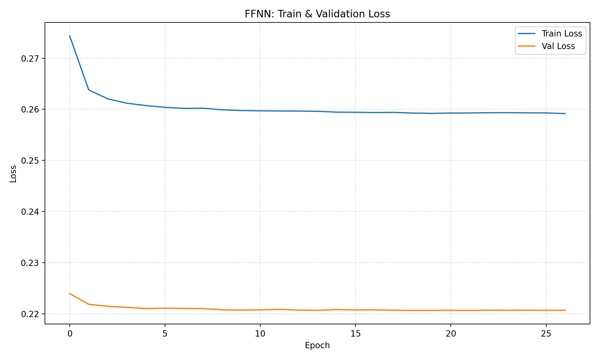
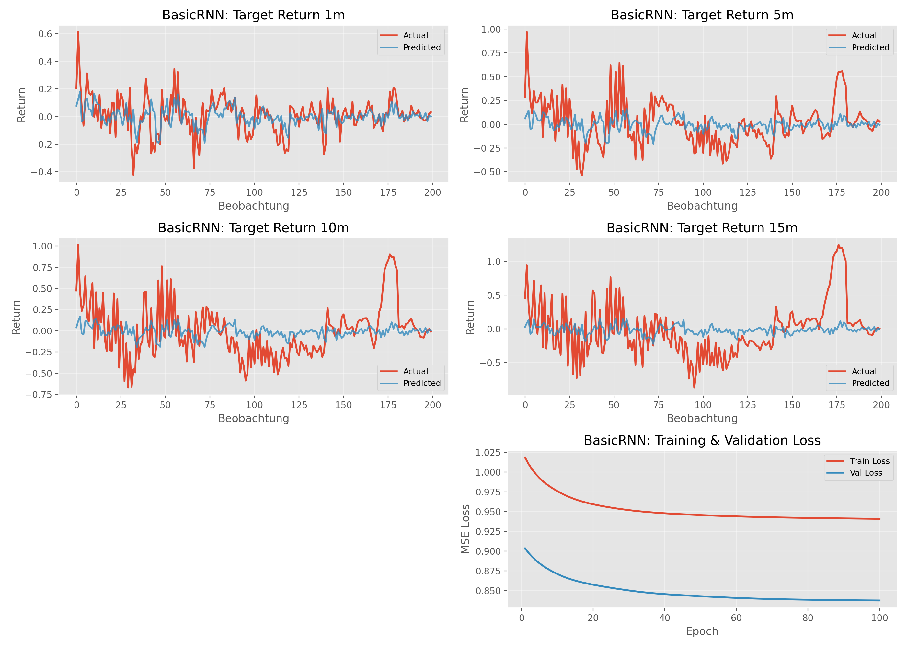

# USW_Trading

### Problem Definition:
**Ziel**

Vorhersage der nächsten t=[1, 5, 10, 15,] Minuten Trendrichtung für ausgewählte NASDAQ-100-Aktien (META, TSLA, AMZN, AAPL, NVDA) während der regulären US-Handelszeiten. Für jede NASDAQ-100-Aktie und jede 1-Minuten-Kerze im Zeitraum vom 01.01.2020 bis 21.11.2025 berechnen wir die die erwartete Preisveränderung über die zukünftigen t Minuten der Aktie. Dabei werden Minuten-Daten und News genutzt, damit wiederkehrende Strukturen wie Volatilität oder newsgetriebene Bewegungen identifiziert werden.

**Input Features**

- Normalisierte Intraday-OHLCV-Daten (Open, High, Low, Close, Volume) mit 1-Minuten-Frequenz und den zugehörigen Log-Returns
- Normalisierte exponentielle gleitende Durchschnitte (EMA) von Preis und Volumen 
- Aktienspezifische Volatilitätsmerkmale
- Normalisierte Indexmerkmale wie NASDAQ-100-Indexrendite und Intraday-Volatilität
- Sentiment-Scores aus Überschriften und Zusammenfassungen pro Aktie

### Verfahrensübersicht:

- Sammelt für die fünf NASDAQ-100-Ticker META, TSLA, AMZN, AAPL und NVDA 1-Minuten-Kursdaten für den Zeitraum vom 01.01.2020 bis 21.11.2025 und ruft Nachrichten pro Ticker ab, um Sentiment-Scores zu berechnen.
- Sagt die Richtung des Trends über nächste t Minuten vorraus mit einem Neural Network
- Verwendet einen Entscheidungsbaum, um Einstiege mit positiver Trendrichtung zu prognostizieren
- Implementiert eine Trading Strategie in Alpaca

**Wir hoffen zu zeigen, dass die Kombination technischer Indikatoren mit News-Sentiment die kurzfristige Trendvorhersage verbessert**

---

## Data Acquisition
Ruft rohe Marktdaten und Nachrichtenartikel für die ausgewählten Nasdaq-100-Symbole ab und berechnet den Sentiment-Score.

**Script**

[scripts/01data_acquisition.py](scripts/01data_acquisition.py)

Holt **1‑minuten** Kerzen von **2020‑01‑01 bis 2025‑11‑21** und schreibt `symbol.parquet` Dateien zu `data/raw/Prices_1m_adj`.

- `columns`: `timestamp`, `open`, `high`, `low`, `close`, `volume`, `trade_count`,`vwap`, `symbol`   

Bar data AAPL Beispiel:

[scripts/fetch_nasdaq100_news_alpaca.py](scripts/fetch_nasdaq100_news_alpaca.py) 

Holt historische Nachrichtenartikel von **2020‑01‑01 bis 2025‑11‑21** und erstellt `symbol.parquet` Dateien zu `data/raw/News_alpaca`

- `colums`: `author`, `content`, `created_at`, `headline`, `id`, `images`, `source`, `summary`, `symbols`, `updated_at`, `url`,`symbol`

[scripts/news_sentiment_score.py](scripts/news_sentiment_score.py)  

Berechnet den Sentiment Score für jeden Nachrichtenartikel und erstellt`data/processed/nasdaq_news_with_sentiment.parquet` file.

- `columns`: `id`, `content`, `symbol`, `sentiment_score`,

Sentiment score AAPL Beispiel:

**API**

#### Alpaca Market Data API
Ruft historische 1-Minuten-Kerzendaten für die ausgewählten NASDAQ-100 Symbole und QQQ über die Alpaca Data API ab. Die Daten werden im Parquet-Format unter `data/raw/Prices_1m_adj` gespeichert.

#### Parameter
- `symbol_or_symbols`: Liste von Tickern
- `timeframe`: 1Min (1-Minuten Bars)
- `start`: Start-Datum 2025-01-01
- `end`: End-Datum 2025-11-21
- `adjustment`: adjustiert für Splits & Dividenden

#### Alpaca Trading API
Filtern nach den Minuten, die innerhalb der regulären Handelszeiten des offiziellen US-Handelskalender liegen.

#### Parameter
- `start`: Start-Datum (01.01.2020)
- `end`: End-Datum 

#### Alpaca News API
Ruft Nachrichtenartikel seit 1.1.2020 für die ausgewählten NASDAQ-bezogene Symbole über die Alpaca News API ab. Die Daten werden in `data/raw/News_alpaca` gespeichert.

#### Parameter 
- `symbols`: Symbole, die geladen werden müssen
- `start`: Start-Datum (01.01.2020)
- `end`: End-Datum (21.11.2025)
- `limit`: 50 (Anzahl Artikel pro Anfrage)
- `sort`: desc
- `include_content`: false (HTML-Content nicht nötig)

#### FinBERT API
Berechnet den sentiment score jedes Nachrichtenartikel. Die Daten werden in `data/processed/nasdaq_news_with_sentiment.parquet` gespeichert.

#### Parameter
- `text`: (Headline + Summary)
- `return_tensors`: pt (Ausgabe als PyTorch-Tensors)
- `truncation`: True (Text wird auf max_length abgeschnitten)
- `max_length`: 512 (maximale Tokenlänge)

---

## 2 - Data Understanding

### Moving Average
Trenderkennung mithilfe von gleitenden Durschnitten

Die Grafik kombiniert den täglichen Schlusskurs von AAPL mit einem kurzfristigen 20-Tage- und einem langfristigen 200-Tage-Durchschnitt. Liegt der Kurs über beiden Linien, dominiert ein Aufwärtstrend. Phasen, in denen der Kurs den 20-Tage-MA von oben nach unten schneidet oder sich dem 200-Tage-MA annähert, markieren dagegen mögliche Trendwechsel oder Korrekturen.

Langfristiger Trend des NASDAQ-100-Index.

Der Indexverlauf mit 20- und 200-Tage-Durchschnitt macht den übergeordneten Markttrend sichtbar. Längere Phasen über dem 200-Tage-MA entsprechen typischen Bullenmärkten, Unterschreitungen deuten auf schwächere Marktphasen hin. So lässt sich AAPLs Entwicklung im Kontext des Gesamtmarktes einordnen.

### Volatilität
Zeigt, wie stark die Aktie im letzten Monat typischerweise geschwankt hat.

Hohe Volatilitätswerte deuten auf turbulente Marktphasen hin – etwa um Krisen, Earnings oder größere Makro-Events. Niedrige Werte stehen für ruhige Marktphasen mit kleineren Tagesbewegungen. Man erkennt, dass AAPL in einzelnen Episoden deutlich erhöhte Schwankungen aufweist, während längere Strecken eher moderat verlaufen.

Der Vergleich mit der entsprechenden Volatilitätskurve des NASDAQ-100-ETF QQQ zeigt, dass AAPL zwar grob den Marktbedingungen folgt, aber zeitweise deutlich volatilere Ausschläge hat – also zusätzlich stock-spezifischem Risiko unterliegt.

### Volumen
Entwicklung des täglichen Handelsvolumens über den betrachteten Zeitraum.

Spitzen im Volumen markieren Tage mit besonderer Marktaktivität, z. B. nach Unternehmensmeldungen oder in Phasen erhöhter Unsicherheit. So können wir sehen, ob starke Kursbewegungen von breitem Marktinteresse getragen werden

### Verteilung log Returns
Analyse der kurz- bis mittelfristigen Kursbewegungen

Die Histogramme zeigen, wie sich AAPLs Log-Returns über 15, 30, 60 und 120 Minuten verteilen. Die meisten Bewegungen liegen sehr nahe bei 0 %. Mit zunehmender Dauer (von 15 min bis 120 min) werden die Verteilungen breiter. über längere Zeitfenster sind größere Preisbewegungen wahrscheinlicher. Für unser Projekt ist das wichtig, weil wir genau diese Bewegungen mit den Targets vorhersagen wollen

### Sentiment-Verteilung
Übersicht der News-Stimmungen im Datensatz.

Die Balkengrafik zeigt, wie viele Artikel sehr negativ, negativ, neutral, positiv oder sehr positiv eingestuft wurden. Man erkennt, dass neutrale bis leicht positive Meldungen dominieren, während extreme Stimmungen seltener sind. Diese Verteilung bildet die Grundlage für alle späteren Analysen, in denen News-Sentiment als erklärende Variable verwendet wird.

### Preisreaktion rund um AAPL-News
Analyse der durchschnittlichen Kursreaktion auf eigene Unternehmensmeldungen.

Die Linien zeigen, wie sich der AAPL-Preis im Umfeld von News-Zeitpunkten entwickelt – getrennt nach Sentimentklassen. Positive und negative Meldungen führen im Schnitt zu steigenden Kursen nach der Veröffentlichung, stark negative Meldungen zu fallenden Preisen. Neutrale News zeigen kaum systematische Bewegung. Das bestätigt, dass Sentiment kurzfristig ein wichtiger Treiber für Kursreaktionen ist.

### Abnormale Preisreaktion vs. QQQ
Stock-spezifische Reaktion im Vergleich zum Markt.

Hier wird die Preisänderung von AAPL relativ zum Index (AAPL minus QQQ) betrachtet. Dadurch werden marktweite Effekte herausgefiltert. Man erkennt, dass positiv bewertete News zu einer Outperformance gegenüber dem Index führen, während sehr negative Meldungen zu deutlicher Underperformance führen. Damit zeigt sich, dass News-Sentiment nicht nur absolute Preise, sondern auch die relative Performance gegenüber dem Markt beeinflusst.

### Trade Count
Trade-Aktivität rund um News-Ereignisse

Die Grafik zeigt, wie stark die Anzahl der Trades im Zeitfenster von −30 bis +30 Minuten relativ zu einem Vor-News-Baseline ansteigt. Rund um den News-Zeitpunkt gibt es in allen Sentiment-Gruppen einen deutlichen Spike der Trade-Aktivität. Das ist wichtig, weil hohe Trade-Aktivität oft mit stärkeren kurzfristigen Trends einhergeht.

## 3 - Pre-Split Preparation

### Main Script

[03_main.py](scripts/03_main.py)

### Feature Engineering Script

[stock_feature_builder.py](scripts/stock_feature_builder.py)

### Target Computation Script

[targets.py](scripts/targets.py)

### Plotting Script

[plot_features.py](scripts/plot_features.py)

### Features Deskriptive Statistik 

| Feature               |        count |      mean |       std |       min |      25% |       50% |       75% |           max |
| :-------------------- | -----------: | --------: | --------: | --------: | -------: | --------: | --------: | ------------: |
| log_ret_1m            | 2 877 728.00 |   0.00000 |   0.00153 |  -0.28670 | -0.00048 |   0.00000 |   0.00048 |       0.21762 |
| log_ret_15m           | 2 877 658.00 |   0.00005 |   0.00575 |  -0.30384 | -0.00185 |   0.00003 |   0.00193 |       0.22827 |
| log_ret_60m           | 2 877 433.00 |   0.00019 |   0.01137 |  -0.30633 | -0.00378 |   0.00019 |   0.00413 |       0.24219 |
| ema_diff_15_60        | 2 877 733.00 |   0.00976 |   0.82766 | -41.19347 | -0.17406 |   0.00751 |   0.19658 |      40.25263 |
| rv_15m                | 2 877 658.00 |   0.00391 |   0.00445 |   0.00000 |  0.00192 |   0.00289 |   0.00449 |       0.28734 |
| rv_60m                | 2 877 433.00 |   0.00845 |   0.00830 |   0.00090 |  0.00423 |   0.00631 |   0.00979 |       0.28820 |
| hl_span               | 2 877 733.00 |   0.26026 |   0.31538 |   0.00000 |  0.08000 |   0.16010 |   0.32000 |      18.21000 |
| volume_zscore_60m     | 2 877 433.00 |   0.06411 |   1.86788 |  -2.81825 | -0.69252 |  -0.26299 |   0.35153 |     327.97364 |
| avg_volume_per_trade  | 2 877 733.00 | 314.82127 | 667.46371 |   4.44474 | 68.85586 | 102.14904 | 287.60417 | 390 857.24771 |
| index_log_ret_1m      | 2 877 728.00 |   0.00000 |   0.00079 |  -0.10743 | -0.00025 |   0.00000 |   0.00026 |       0.05820 |
| index_rv_60m          | 2 877 433.00 |   0.00446 |   0.00419 |   0.00057 |  0.00227 |   0.00336 |   0.00517 |       0.11237 |
| rel_log_ret_60m       | 2 877 433.00 |   0.00008 |   0.00849 |  -0.28312 | -0.00259 |  -0.00004 |   0.00256 |       0.21896 |
| effective_sentiment_t | 2 877 733.00 |   0.15029 |   0.40763 |  -0.93984 |  0.00000 |   0.07549 |   0.48191 |       0.93162 |

### Targets Deskriptive Statistik

| Zeitraum           |      count |    mean |     std |       min |      25% |     50% |     75% |      max |
| :----------------- | ---------: | ------: | ------: | --------: | -------: | ------: | ------: | -------: |
| target_return_15m  | 2877658.00 | 0.00479 | 0.39869 | -25.21680 | -0.11837 | 0.00396 | 0.12510 | 23.75567 |
| target_return_30m  | 2877583.00 | 0.00875 | 0.54972 | -25.21831 | -0.16640 | 0.00718 | 0.17893 | 23.76203 |
| target_return_60m  | 2877433.00 | 0.01633 | 0.76553 | -24.86983 | -0.23849 | 0.01303 | 0.26144 | 24.19581 |

### Sample Features mit Targets

| # | log_ret_1m | log_ret_15m | log_ret_60m | ema_diff_15_60 | rv_15m | rv_60m | volume_zscore_60m | avg_volume_per_trade | hl_span | index_log_ret_1m | index_rv_60m | rel_log_ret_60m | effective_sentiment_t | target_return_15m | target_return_30m | target_return_60m |
|:--|-----------:|------------:|------------:|---------------:|-------:|-------:|-------------------:|---------------------:|--------:|------------------:|-------------:|----------------:|----------------------:|------------------:|------------------:|------------------:|
| 1 | -0.001 | 0.020 | 0.019 | 1.971 | 0.015 | 0.016 | 0.013 | 61.079 | 0.410 | 0.000 | 0.008 | 0.007 | -0.143 | -0.012 | -0.176 | -0.529 |
| 2 | -0.001 | -0.002 | -0.008 | -1.039 | 0.003 | 0.009 | -0.579 | 42.504 | 0.640 | 0.000 | 0.005 | -0.008 | 0.496 | -0.076 | -0.119 | 0.147 |
| 3 | 0.001 | 0.001 | 0.001 | 0.093 | 0.002 | 0.005 | -0.491 | 50.290 | 0.290 | 0.001 | 0.005 | 0.000 | -0.651 | -0.011 | 0.050 | 0.119 |
| 4 | 0.001 | -0.001 | -0.003 | -0.021 | 0.003 | 0.007 | -0.862 | 52.267 | 0.220 | 0.001 | 0.005 | -0.004 | 0.228 | 0.023 | 0.196 | 0.471 |
| 5 | 0.003 | 0.001 | 0.002 | 1.093 | 0.006 | 0.012 | -0.926 | 54.797 | 1.370 | 0.001 | 0.005 | 0.002 | 0.001 | 0.272 | 1.256 | 1.558 |
| 6 | 0.002 | 0.002 | -0.001 | 0.237 | 0.003 | 0.009 | -0.801 | 110.180 | 0.370 | 0.001 | 0.005 | -0.002 | -0.592 | -0.089 | -0.021 | 0.184 |
| 7 | 0.001 | -0.002 | -0.006 | -0.966 | 0.003 | 0.008 | -1.180 | 20.782 | 0.620 | 0.001 | 0.005 | -0.007 | 0.485 | -0.017 | -0.027 | 0.251 |
| 8 | 0.001 | 0.004 | 0.003 | 0.205 | 0.002 | 0.004 | 2.055 | 122.760 | 0.180 | 0.000 | 0.002 | 0.004 | 0.716 | 0.173 | 0.167 | 0.182 |
| 9 | 0.001 | 0.002 | 0.002 | 0.823 | 0.002 | 0.004 | 0.651 | 53.125 | 0.690 | 0.000 | 0.002 | 0.003 | 0.217 | 0.117 | 0.146 | 0.243 |
|10 | 0.001 | 0.003 | 0.002 | 0.748 | 0.003 | 0.007 | -0.472 | 67.540 | 0.630 | 0.000 | 0.002 | 0.003 | 0.680 | 0.166 | 0.490 | 0.901 |
|11 | 0.000 | -0.002 | -0.004 | -0.178 | 0.002 | 0.004 | -1.447 | 39.433 | 0.130 | 0.000 | 0.002 | -0.003 | 0.680 | -0.138 | -0.136 | -0.079 |
|12 | 0.000 | -0.001 | -0.005 | -0.268 | 0.001 | 0.003 | 2.606 | 93.801 | 0.100 | 0.000 | 0.002 | -0.004 | 0.716 | -0.021 | 0.047 | 0.104 |
|13 | -0.001 | 0.017 | 0.016 | 1.478 | 0.015 | 0.015 | 0.033 | 59.111 | 0.520 | 0.000 | 0.008 | 0.006 | -0.149 | 0.375 | 0.249 | -0.094 |
|14 | 0.002 | -0.004 | 0.000 | -0.164 | 0.006 | 0.007 | 0.599 | 69.889 | 0.590 | 0.000 | 0.008 | -0.011 | 0.833 | 0.452 | 0.439 | 0.403 |
|15 | 0.004 | 0.011 | 0.018 | 1.942 | 0.015 | 0.017 | 1.513 | 63.368 | 3.340 | 0.000 | 0.008 | 0.008 | -0.305 | 0.945 | 1.098 | 0.861 |

## 4 - Data-Split 
Data Split Script

[split_dataset.py](scripts/split_dataset.py)

## 5 - Post-Split Preparation
Post Split Script
[post_split_scale.py](scripts/post_split_scale.py)

### X-Unscaled

### X-Scaled

### Y-Unscaled

### Y-Scaled

### Feature Target Korrelation Matrix

Die Feature-Target-Korrelation zeigt, dass nur wenige Features überhaupt einen nennenswerten linearen Zusammenhang mit den zukünftigen Returns haben. Am stärksten ist log_ret_1m mit dem 1-Minuten-Target korreliert (ca. 0,37), gefolgt von index_log_ret_1m (ca. 0,26). Für längere Horizonte nimmt die Korrelation dieser beiden Features deutlich ab, z.B. auf nur noch etwa 0,13 beim 15-Minuten-Return. Alle anderen Features – weitere Log-Returns, EMA-Spread, Realized Volatility, Volumen-Maße, High-Low-Span und News-Sentiment – liegen im Bereich von 0,00 bis maximal ca. 0,1 und tragen damit nur sehr schwache lineare Signale bei. Insgesamt bestätigt die Matrix, dass kurzfristige Intraday-Returns stark vom Rauschen dominiert werden, insbesondere für längere Vorhersagehorizonte.

## 6 – Model Training

Wir haben drei Modellklassen getestet, um die vier Return-Horizonte (1m, 5m, 10m, 15m) vorherzusagen:

1. Ein **Feed-Forward Neural Network (FFNN)** auf den skalierten Tabellendaten aus Step 5  
2. Ein **einfaches RNN** mit Sliding-Window-Sequenzen  
3. Ein **LSTM**, das Sequenzen pro Symbol direkt auf den Zeitreihen-Splits nutzt  

Alle Modelle werden gegen eine einfache Zero-Return-Baseline (Vorhersage = 0) mit MSE / RMSE / MAE / R² verglichen. 

---

### 6.1 Feed-Forward Neural Network (FFNN)

Das FFNN dient als tabellarische Referenz: Es nutzt die in Step 5 erzeugten, skalierten Feature-Matrizen (inklusive Symbol-Dummies) und sagt die vier Return-Horizonte direkt aus einem einzelnen Zeit-Snapshot vorher. Zeitliche Abhängigkeiten werden nicht explizit modelliert.

#### FFNN-Skript

[`scripts/ffnn_modeling.py`](scripts/ffnn_modeling.py) 

#### FFNN-Architektur & Training

- Input: alle skalierten Features aus `X_*_scaled.parquet` 
- Output: 4 Targets  
  (`target_return_1m`, `target_return_5m`, `target_return_10m`, `target_return_15m`)
- Architektur:
  - Hidden 1: 64 Neuronen  
  - Hidden 2: 32 Neuronen  
  - Aktivierung: ReLU
  - Dropout: p = 0.2 nach jeder Hidden-Schicht
- Optimizer: AdamW (LR = 1e-3, Weight Decay = 1e-4)
- Batch-Größe: 4096

#### FFNN – Actuals vs. Predicted (erste 500 Samples)

Auf dem Testset folgt das FFNN den vielen kleinen Intraday-Bewegungen insbesondere beim 1-Minuten-Horizon relativ gut. Die vorhergesagten Kurven liegen eng um die tatsächlichen Returns und bilden die typische „Zitterbewegung“ des Marktes ab. 

Bei längeren Horizonten (5m, 10m, 15m) werden die Vorhersagen deutlich glatter: Das Modell bleibt stärker um 0 zentriert und unterschätzt große Ausschläge. Extreme Spikes im Return (plötzliche Sprünge nach oben oder unten) werden meist nicht in ihrer Amplitude getroffen. Das ist für Intraday-Returns erwartbar, zeigt aber, dass das Modell primär die häufigen, kleinen Bewegungen lernt und seltene Extrembewegungen kaum abbildet.

#### FFNN – Loss-Kurven

Die Train- und Validation-Losses fallen in den ersten Epochen schnell ab und laufen dann in ein Plateau. Die beiden Kurven liegen relativ dicht beieinander, was gegen starkes Overfitting spricht. Gleichzeitig flacht die Verbesserung deutlich ab – mit der aktuellen Feature-Menge und Architektur ist nur begrenzter zusätzlicher Performance-Gewinn zu erwarten, ohne das Modell grundsätzlich zu verändern oder weitere Informationen (z.B. bessere Features oder mehr Daten) zu nutzen.

#### FFNN – Quantitative Ergebnisse

(Zero-Baseline = immer Return 0 vorhersagen)

- **Baseline (Zero-Return)**  
  - MSE ≈ 0.0773  
  - RMSE ≈ 0.2780  
  - MAE ≈ 0.1401  
  - R² ≈ 0.00

- **FFNN (Test-Set, echte Returns)**  
  - MSE ≈ 0.0746  
  - RMSE ≈ 0.2731  
  - MAE ≈ 0.1348  
  - R² ≈ 0.035

Das FFNN reduziert den mittleren quadratischen Fehler gegenüber der trivialen Zero-Baseline nur leicht (R² ≈ 3,5 %). Das zeigt, dass kurzfristige Intraday-Returns stark vom Rauschen dominiert werden und sich aus den verfügbaren Features nur ein begrenzter, aber messbarer Edge herausholen lässt.

---

### 6.2 Basic RNN

Als nächsten Schritt testen wir ein einfaches rekurrentes neuronales Netz (RNN), das explizit mit zeitlichen Sequenzen arbeitet. Statt jeden Timestamp isoliert zu betrachten wie beim FFNN, bekommt das RNN kleine Zeitfenster (Sliding Windows) der skalierten Features als Input. Ziel ist es, kurzfristige Muster im Verlauf besser auszunutzen.

#### RNN-Skript

[`scripts/rnn_modeling.py`](scripts/rnn_modeling.py)

#### RNN-Architektur & Datenaufbau

- Eingangsdaten:
  - Sequenzen der Form `X[t−19 … t]` mit Sequenzlänge **20**
  - Basierend auf den Step-5-Parquets `X_*_scaled.parquet` / `y_*_scaled.parquet`
  - Enthalten alle numerischen Features **inkl. Symbol-Dummies** pro Zeitschritt
- Targets:
  - `y[t]` mit den vier Return-Horizonten in skaliertem Raum, inverse Transform via `scaler_y`
- Modell:
  - Basic `nn.RNN`
  - Input Size = Anzahl Features
  - Hidden Size = 64
  - Num Layers = 1
  - Output: 4 Targets über eine lineare Projektion des letzten Zeitschritts
- Loss: MSE
- Optimizer: Adam (LR = 1e-3)

#### RNN – Ergebnisse & Plots

In den Plots ist zu sehen, dass das BasicRNN die 1-Minuten-Returns etwas glättet und einen Teil der lokalen Muster einfängt. Die vorhergesagten Kurven liegen überwiegend in der Nähe von 0 und reagieren weniger stark auf die vielen, sehr schnellen Schwankungen der Originaldaten. Für 5m, 10m und 15m werden die Vorhersagen noch glatter und die Amplituden deutlich unterschätzt; starke Ausschläge werden kaum mitgemacht.

Die Loss-Kurven zeigen einen kontinuierlichen Abfall des Trainings- und Validierungs-Losses. Gleichzeitig bleibt das absolute Fehlerniveau relativ hoch und nähert sich nur langsam einem Plateau an. Insgesamt liegt die Performance des RNNs in unseren Läufen sehr nahe an der Zero-Return-Baseline: Es gibt leichte Verbesserungen bei sehr kurzen Horizonten, aber keine klare, deutliche Überlegenheit gegenüber dem FFNN.

#### RNN – Quantitative Ergebnisse

(Zero-Baseline = immer Return 0 vorhersagen)

- **Baseline (Zero-Return)**  
  - MSE ≈ 7.725245e-02  
  - RMSE ≈ 2.779432e-01
  - MAE ≈ 0.1401  
  - R² ≈ 1.400910e-01

- **FFNN (Test-Set, echte Returns)**  
  - MSE ≈ 7.479174e-02 
  - RMSE ≈ 2.734808e-01 
  - MAE ≈ 1.353122e-01  
  - R² ≈ 0.0318

Interpretation:

- Das einfache RNN hat zwar Zugang zu Sequenzinformationen, ist mit nur einer Layer und 64 Hidden Units aber relativ schwach und tendiert zur **Unteranpassung (Underfitting)**.

---

### 6.3 LSTM

Im dritten Schritt verwenden wir ein LSTM, das stärker auf Zeitreihen-Strukturen ausgelegt ist. Im Unterschied zum RNN arbeitet das LSTM direkt auf den **Zeitreihen-Splits pro Symbol** (`usw_*_clean.parquet`) und baut Sequenzen getrennt je Aktie. Dadurch kann das Modell saubere historische Verläufe pro Symbol sehen, statt gemischte Sliding-Windows über alle Symbole.

#### LSTM-Skript

[`scripts/lstm_modeling.py`](scripts/lstm_modeling.py) 

#### LSTM-Datenaufbau & Architektur

- Eingangsdaten:
  - Train/Val/Test aus `data/processed/splits/usw_*_clean.parquet`
  - Gruppierung **pro `symbol`**
  - Features: nur die numerischen `FEATURE_COLS` 
  - Eigener `StandardScaler` auf `FEATURE_COLS` für X, `scaler_y` aus Step 5 für die Targets
  - Sequenzen der Form `X[t−29 … t]` mit **Sequenzlänge 30**, Target = `y[t]`
- Targets:
  - vier Return-Horizonte auf Originalskala via inverse Transform
- Architektur:
  - 2-lagiges LSTM
  - Hidden Size: 128
  - Dropout: 0.2 (zwischen den LSTM-Layern)
  - Fully Connected Layer auf die letzte Hidden-State-Repräsentation
- Optimizer & Training:
  - Adam (LR = 1e-3)
  - ReduceLROnPlateau (Faktor 0.5, Patience 2)
  - Batch Size: 32, Sequenzen pro Symbol werden zu einem großen Datensatz konkateniert

#### LSTM – Plots (erste 200 Samples)

Für den 1-Minuten-Horizont folgt das LSTM den tatsächlichen Returns am ehesten: Die Vorhersagen bewegen sich mit der Zeit um die echten Werte und fangen Richtung und grobe Struktur einiger Bewegungen ein, bleiben aber in der Amplitude merklich kleiner. Für 5m, 10m und 15m sind die Vorhersagen noch stärker um 0 zusammengezogen, sodass größere Ausschläge im Markt fast vollständig „weggemittelt“ werden.

Im Loss-Plot ist zu sehen, dass das Training sehr schnell stoppt: Bereits nach wenigen Epochen erreicht der Validierungs-Loss sein Minimum, und Early Stopping greift. Dadurch bleibt das Modell eher konservativ und tendiert zu **stark geglätteten** Vorhersagen.

#### LSTM – Quantitative Ergebnisse

Ein exemplarischer Run zeigt:

- **Baseline (Zero-Return)**  
  - MSE :  7.725123e-02
  - RMSE:  2.779410e-01
  - MAE :  1.399844e-01
  - R^2 :  -0.0001

- **LSTM (gesamt, alle 4 Targets)**  
  - MSE :  7.509433e-02
  - RMSE:  2.740334e-01
  - MAE :  1.350939e-01
  - R^2 :  0.0278

[METRICS] Pro Target:
  - Target Return 1m: MSE=1.559110e-02 | RMSE=1.248643e-01 | MAE=5.824056e-02 | R^2=0.1296
  - Target Return 5m: MSE=5.036982e-02 | RMSE=2.244322e-01 | MAE=1.168164e-01 | R^2=0.0439
  - Target Return 10m: MSE=9.349006e-02 | RMSE=3.057614e-01 | MAE=1.636007e-01 | R^2=0.0217
  - Target Return 15m: MSE=1.409328e-01 | RMSE=3.754102e-01 | MAE=2.017170e-01 | R^2=0.0133

Momentan profitiert nur der sehr kurzfristige Horizont spürbar von der sequenziellen LSTM-Struktur; für längere Horizons überwiegt der Glättungseffekt und die Vorhersagen sind zu konservativ.

---

## 7 - Backtesting

### 7.1 Backtesting Skript (Feed Forward % LSTM)
[scripts/backtesting.py](scripts/backtesting.py)

- Entry Points: 
  - Long-only  
  - Entry-Bedingung:
    - Signal aus Return Vorhersagen von 5 Minuten und 15 Minuten ist größer als entry_threshold (0.1%) 
    - Zusätzlich muss die 3-Minuten-Prognose positiv sein. 

- Exit Points 
  - Eine offene Position wird geschlossen, sobald eine der folgenden Bedingungen erfüllt ist: 
    - Exit wenn der Trade-Return seit Entry >= tp (+0.7%)
    - Exit wenn der Trade-Return seit Entry <= -sl (−0.3%)
    - Exit wenn die Haltedauer in echten Minuten >= max_hold (15 Minuten)
    - Exit wenn signal < exit_threshold (-0.03%)

### Backtesting Plot Equity (Feed Forward)

- Overall Performance:
   - total_return: 5.958%
   - max_drawdown: -2.118%
   - win_rate: 38.673%
   - avg_trade: 0.018%
   - median_trade: -0.110%

### Backtesting Plot Equity (LSTM)

- Overall Performance:
   - total_return: 3.387%
   - max_drawdown: -3.407%
   - win_rate: 37.936%
   - avg_trade: 0.007%
   - median_trade: -0.084%

### Backtesting Plot Trade Entries (Feed Forward)

### Backtesting Plot Trade Entries (LSTM)

### Backtesting Plot Trades (Feed Forward)

### Backtesting Plot Trades (LSTM)

---

## 8 - Paper Trading

### 8.1 Paper Trading Skript (Feed Forward % LSTM)
[scripts/paper_trade_lstm.py](scripts/paper_trade_lstm.py)

- Setup
  - Broker: Alpaca Paper Account
  - Aktien: META, NVDA, TSLA
  - Signal: Das trainierte Modell erzeugt pro Minute Vorhersagen für mehrere Horizonte. Daraus wird ein Signal gebildet: signal = 0.6 · pred(5m) + 0.4 · pred(15m)
  - Order-Typ: Entries werden als Market Orders gesendet wenn das Signal positiv genug ist. Exits passieren durch negative Signale Max-Hold Überschreitung oder TP/SL .
  - Positionsgröße: Stückzahl pro Symbol ist auf einen Wert von 1000 USD begrenzt.

- Aktien Performance:
  - Realisierter Netto-Cashflow aus dem Log (Sell − Buy):
    - TSLA: +$6.22
    - NVDA: +$3.73
    - META: +$0.37

Gesamt: +$10.32

- Time Frame:
  - Trading-Session: am Dec 15, 2025 zwischen ca. 20:44–21:53.
 
- Time Frame Performance:
  - Aufgeteilt in drei Trading-Fenster (jeweils alle drei Symbole):
    - 20:44 → 21:13 ca. +$3.72
    - 21:20 → 21:37 ca. +$1.49
    - 21:46 → 21:53 ca. +$5.11

   
### Paper Trade Equity (Feed Forward)

- Total_return: +$10.32 / +0.0103%
- win_rate: 8/9 = 88.9% (1 Loss-Trade, META)
- avg_trade: +0.1256% pro Trade (+$1.15)
- median_trade: +0.1288% pro Trade (+$1.23)

- Beispiel-Trade 1 – META
  - Buy: 1 META → −$650.98 (Dec 15, 2025, 09:20:50 PM)
  - Sell: 1 META → +$650.59 (Dec 15, 2025, 09:33:17 PM)
  - Realisierter PnL: −$0.39
 
- Beispiel-Trade 2 – TSLA
  - Buy: 2 TSLA @ $956.82 (Dec 15, 2025, 09:46:12 PM) → −$956.82
  - Sell: 1 TSLA @ $480.01 + Sell: 1 TSLA @ $480.00 (Dec 15, 2025, 09:53:46 PM) → +$960.01
  - Realisierter PnL: +$3.19
 

---

## Next Steps
- Signal- und Entscheidungslogik verbessern
- Feature-Qualität erhöhen
- Modell verbessern
- Weitere Zeithorizonte betrachten
- Shorting hinzufügen
